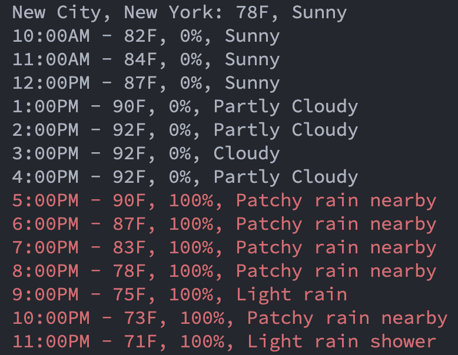

# Go Weather

A simple CLI tool to show the days forecast using the [weatherapi](https://www.weatherapi.com/).



## Features

- Current weather conditions including temperature.
- Hourly forecast for the current day.
- Color-coded output for easy reading, with high chance of rain highlighted.

## Prerequisites

Before you begin, ensure you have met the following requirements:

- Go installed on your machine.
- An API key from [weatherapi.com](https://www.weatherapi.com/).

## Installation

1. Clone the repository:

   ```sh
   git clone https://github.com/ariel-nathan/go-weather.git
   ```

2. Navigate to the project directory:

   ```sh
   cd go-weather
   ```

3. Install the dependencies:
   ```sh
   go mod tidy
   ```

## Configuration

1. Create a .env file in the root directory.
2. Add your weatherapi.com API key:

```sh
WEATHERAPI_KEY=your_api_key_here
```

## Usage

To run Go Weather, use the following command from the root of the project:

```sh
go run main.go [location]
```

Replace `[location]` with your desired location. If no location is provided, it defaults to "New York City".

## License

This project is open-source and available under the MIT License.
